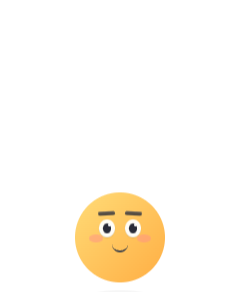
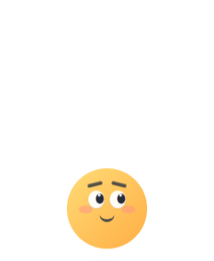
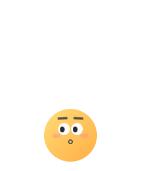

# 桌宠形象设计稿

## 设计方向

上一版形象以「黄色圆球桌宠」为主体，参考 Las Vegas Sphere / Orbi 类表情球的简洁脸部比例。设计重点是小巧、干净、可爱，并在原先基础上增加鼠标靠近时的表情变化。

这一版不强调性别化装饰，不加入蝴蝶结、睫毛、头发、衣服、底座、手脚等额外造型，只通过圆球本体、眉眼嘴和腮红表达情绪。

## 视觉参考

以下图片来自上一版已提交实现，用作后续迭代的视觉基准。

### 默认状态

### 鼠标靠近

### 点击惊讶

## 造型原则

- 主体保持纯圆形黄色球体。
- 不加底座、腿、手臂或复杂装饰。
- 五官保持小而集中，避免过度夸张。
- 眉毛使用细短眉，不能太粗、太低或压住眼睛。
- 嘴巴默认是小微笑，不能长期张开。
- 表情变化要轻，不要让默认状态显得紧张或夸张。

## 当前视觉元素

### 主体

- 形状：正圆形。
- 色彩：暖黄色渐变。
- 风格：干净、轻量、像一个会互动的表情球。
- 阴影：保留底部轻微阴影，增加桌面悬浮感。

### 眼睛

- 白色圆眼，尺寸偏小。
- 黑色瞳孔可跟随鼠标方向移动。
- 有小高光，增加灵动感。
- 鼠标靠近时眼睛略微变大。

### 眉毛

- 使用细短眉。
- 颜色为深灰，不使用纯黑。
- 默认状态接近平直，轻微倾斜。
- hover / curious / surprised 状态下可上扬或倾斜。
- 避免粗横条眉毛，避免与眼睛比例不协调。

### 嘴巴

- 默认是很小的弧形微笑。
- 鼠标靠近或说话时微笑略变大。
- 点击惊讶时短暂变成小圆嘴。
- 默认不张嘴。

### 腮红

- 粉色半透明椭圆。
- 默认较轻，不能抢五官。
- hover / talk 状态下可稍微增强。

## 鼠标交互表情

### 默认

- 眼睛看正前方。
- 眉毛自然放松。
- 小微笑。
- 整体情绪安静、亲近。

### 鼠标靠近

- 眼睛稍微放大。
- 瞳孔朝鼠标方向移动。
- 眉毛轻微上扬。
- 腮红略明显。

### 鼠标很近 / hover

- 表情更关注用户。
- 眼睛和嘴巴略放大。
- 保持可爱但不过度兴奋。

### 点击

- 短暂切到关注或惊讶表情。
- 惊讶状态用小圆嘴表现。
- 不长期保持张嘴。

### 拖拽

- 拖拽时脸部轻微压扁。
- 松开后短暂晕乎表情。

### 说话

- 切到轻微开心 / talk 表情。
- 眼睛稍大，嘴巴略大。
- 表情持续时间短，结束后回到默认或鼠标相关状态。

## 后续迭代边界

- 不要加入明显性别化装饰。
- 不要加入复杂人物五官、头发、衣服。
- 不要加入底座、手脚、道具。
- 不要让眉毛太粗或太低。
- 不要让嘴巴默认张开。
- 不要用太多装饰破坏圆球轮廓。
